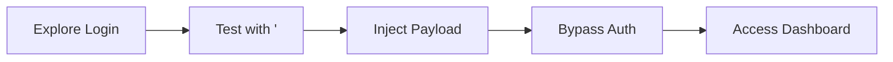

# Chapter W2: Review

## What You Learned

In this chapter, you crossed the line from reconnaissance to exploitation. Where Chapter W1 mapped the attack surface from the outside, Chapter W2 demonstrated how a single vulnerability in input handling can give an attacker full access to an authenticated application.

You tested a login form for SQL injection by injecting a single quote to break the SQL query structure, then used comment markers to eliminate the password check entirely. The result was authentication bypass: logging in as the admin user without knowing the password. The attack is not theoretical. SQL injection has been responsible for some of the largest data breaches in history, and it continues to appear in penetration tests because developers still build queries by concatenating user input.

The ShopSecure engagement demonstrated a realistic scenario. A CTO suspected weak input handling, and your test confirmed it. In a real engagement, this finding would be classified as critical severity: it grants full application access to any unauthenticated attacker.

## The Attack You Performed

| Lab  | Skill Learned                     | Key Technique               | Flag                            |
|------|-----------------------------------|-----------------------------|---------------------------------|
| W2.1 | SQL injection auth bypass         | `admin' --` in login form   | `OCR{________}` |

## Key Concepts Revisited

- **SQL injection**: a vulnerability where user input is inserted into SQL queries without sanitisation, allowing attackers to manipulate database operations.
- **String delimiter escape**: the single quote (`'`) closes the intended string boundary in SQL, causing subsequent characters to be interpreted as SQL syntax.
- **Comment injection**: `--` (SQL standard) and `#` (MySQL) comment out the remainder of a query, eliminating conditions like password checks.
- **Authentication bypass**: injecting SQL that makes the WHERE clause return true without valid credentials, granting unauthorised access to user accounts.
- **Parameterised queries**: the primary defence against SQL injection, separating query structure from user-supplied data so input can never become executable SQL.

## Self-Assessment

Answer each question from memory before checking the answer key at the bottom of the page.

**1. What character is the fundamental test for SQL injection in string-based inputs?**

> &nbsp;

**2. What do `--` and `#` do in a SQL query?**

> &nbsp;

**3. Why does `admin' --` bypass the password check in a vulnerable login form?**

> &nbsp;

**4. What is the difference between a SQL error response and a generic "login failed" response when testing for injection?**

> &nbsp;

**5. What programming technique prevents SQL injection?**

> &nbsp;

## Command Cheat Sheet

| Command / Payload                                                  | Purpose                                         |
|--------------------------------------------------------------------|-------------------------------------------------|
| `'`                                                                | Test for SQL injection (break string delimiter)  |
| `admin' --`                                                        | Bypass password check (SQL standard comment)     |
| `admin'#`                                                          | Bypass password check (MySQL comment)            |
| `' OR '1'='1`                                                      | Always-true condition (bypass all checks)        |
| `curl -X POST <url> -d "user=admin' --&pass=x"`                    | Submit injection payload via curl                |
| `curl -X POST <url> --data-urlencode "user=admin' --" -v -L`       | URL-encoded payload with redirect following      |

## Connect the Dots: What Comes Next

You have now completed both the reconnaissance and initial exploitation phases of web application testing. In Chapter W1, you mapped the attack surface. In Chapter W2, you demonstrated that a single unsanitised input can compromise an entire authentication system.

Together, these chapters establish the web application penetration testing workflow:

1. **Discover**: find directories, endpoints, and subdomains (W1.1 to W1.5)
2. **Fingerprint**: identify technologies and assess security posture (W1.2, W1.4)
3. **Test**: probe for vulnerabilities in application logic (W2.1)
4. **Exploit**: demonstrate impact through successful attacks (W2.1)
5. **Document**: record findings with evidence for the report (all labs)

Future chapters will expand the exploitation phase with additional vulnerability types: cross-site scripting, insecure direct object references, and more advanced SQL injection techniques. The reconnaissance skills from Chapter W1 and the injection fundamentals from Chapter W2 form the foundation for everything that follows.

---

## Self-Assessment Answer Key

**1.** The single quote (`'`) is the fundamental test character for SQL injection in string-based inputs. It breaks the string delimiter in the SQL query.

**2.** `--` (followed by a space) and `#` are comment markers in SQL. Everything after them on that line is ignored by the database engine. `--` is the SQL standard comment; `#` is MySQL-specific.

**3.** The single quote closes the username string, and `--` comments out the `AND password='...'` portion of the query. The database executes `WHERE username='admin'` without checking the password, returning the admin record unconditionally.

**4.** A SQL error response (e.g., "You have an error in your SQL syntax") confirms the input reaches the database unsanitised: definitive proof of vulnerability. A generic "login failed" response means the application either sanitises the input or uses a generic error handler, so the injection may still work but requires further testing with different payloads.

**5.** Parameterised queries (prepared statements) prevent SQL injection by compiling the query structure separately from user data. The data is bound to placeholders and can never be interpreted as SQL syntax, regardless of its content.
