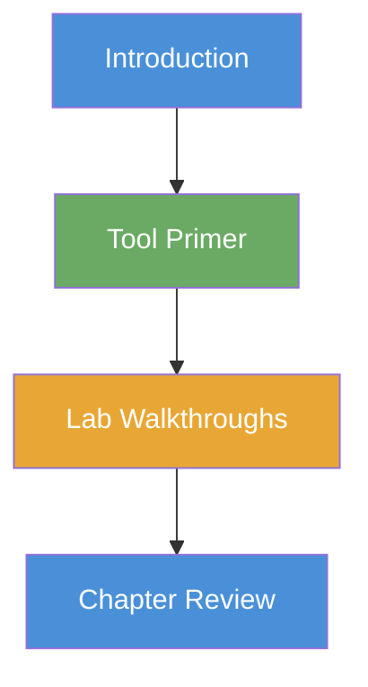
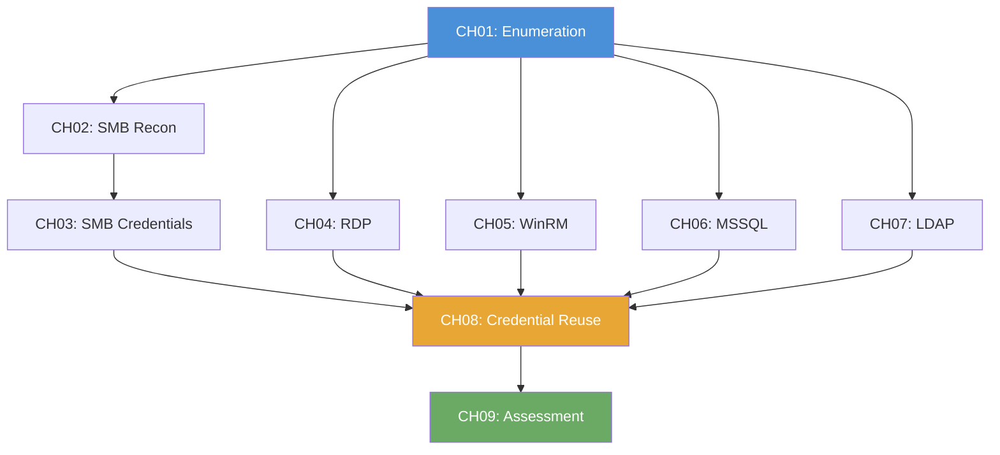

# Windows Penetration Testing: Student Workbook

## What Is a Workbook?

The User Manual explains how the platform works. The Workbook walks you through the actual labs; what to type, what the output means, where to record your findings, and why each step matters. Think of it as a guided companion that sits next to you while you work through each exercise.

Each chapter covers one level of the Windows track. Inside each chapter, every lab is presented as a self-contained walkthrough with:

- **Background** explaining the protocol, service, or technique you are about to use; written for someone encountering it for the first time
- **Tool Primer** covering the specific tool commands you will run, what each flag does, and how to read the output
- **The Walkthrough** guiding you through the lab step by step, with prompts to record your actual findings along the way
- **Analysis Questions** asking you to interpret what you found and understand what it means, rather than just copying output
- **Key Takeaways** summarizing what you learned and how it connects to the next exercise

---

## How the Workbook Is Structured

The Windows track has 51 labs across 9 levels. Each level becomes one chapter in the workbook:

```
Workbook/
├── README.md                          ← You are here
│
├── CH01_Enumeration/
│   ├── 00_Introduction.md             ← What enumeration is and why it matters
│   ├── 01_Basic_Port_Scan.md          ← Lab 1.1 walkthrough
│   ├── 02_Multiple_Port_Discovery.md  ← Lab 1.2 walkthrough
│   ├── 03_Service_Version_Detection.md
│   ├── 04_OS_Detection.md
│   ├── 05_Comprehensive_Enumeration.md
│   └── 06_Chapter_Review.md           ← Recap, self-assessment, cheat sheet
│
├── CH02_SMB_Reconnaissance/
│   ├── 00_Introduction.md             ← What SMB is, how file sharing works
│   ├── 01_Connection_Test.md          ← Lab 2.1 walkthrough
│   ├── ...                            ← Labs 2.2 through 2.8
│   └── 09_Chapter_Review.md
│
├── CH03_SMB_Credential_Attacks/
│   ├── 00_Introduction.md             ← What credential attacks are and where passwords come from
│   ├── ...                            ← Labs 3.1 through 3.5
│   └── 06_Chapter_Review.md
│
├── CH04_RDP/
│   ├── 00_Introduction.md             ← What Remote Desktop Protocol is and where you see it
│   ├── ...                            ← Labs 4.1 through 4.6
│   └── 07_Chapter_Review.md
│
├── CH05_WinRM/
│   ├── 00_Introduction.md             ← What Windows Remote Management is and when admins use it
│   ├── ...                            ← Labs 5.1 through 5.6
│   └── 07_Chapter_Review.md
│
├── CH06_MSSQL/
│   ├── 00_Introduction.md             ← What MS-SQL is and why databases are high-value targets
│   ├── ...                            ← Labs 6.1 through 6.7
│   └── 08_Chapter_Review.md
│
├── CH07_LDAP/
│   ├── 00_Introduction.md             ← What LDAP and Active Directory are
│   ├── ...                            ← Labs 7.1 through 7.6
│   └── 07_Chapter_Review.md
│
├── CH08_Credential_Reuse/
│   ├── 00_Introduction.md             ← Why one password can compromise an entire network
│   ├── ...                            ← Labs 8.1 through 8.5
│   └── 06_Chapter_Review.md
│
└── CH09_Complete_Assessment/
    ├── 00_Introduction.md             ← Putting it all together into a real engagement
    ├── ...                            ← Labs 9.1 through 9.3
    └── 04_Chapter_Review.md
```

---

## Chapter Anatomy

Every chapter follows the same structure so you always know what to expect:



| Section | What It Contains |
|---------|-----------------|
| **Introduction** | Protocol background, why attackers target it, real-world context |
| **Tool Primer** | Commands you will use, what each flag does, how to read the output |
| **Lab Walkthroughs** | Step-by-step guidance, record your findings, interpret the results |
| **Chapter Review** | Key takeaways, self-assessment quiz, command cheat sheet |

### Chapter Introduction (00_Introduction.md)

Every chapter opens with 2-3 pages of background that explain the protocol or service in plain language. The introduction answers three questions:

1. **What is it?**: What the service does in a normal IT environment (for example, "SMB is the protocol Windows uses to share files and printers across a network")
2. **Why do attackers care?**: What makes the service a target (for example, "SMB often allows anonymous access by default, which means anyone on the network can list shared folders without a password")
3. **What will you learn in this chapter?**: A preview of the skills the upcoming labs teach, mapped to real-world penetration testing methodology

### Tool Primer (embedded in each walkthrough)

Before a tool is used for the first time, the walkthrough includes a primer section that explains:

- What the tool does in one sentence
- The exact command syntax with every flag explained
- A sample output block showing what a successful result looks like
- Common mistakes and what they look like

### Lab Walkthroughs (one per lab)

Each lab walkthrough is the core of the workbook. It guides the student through the exercise while teaching the underlying concepts. The walkthrough format is:

> **Before You Begin**: prerequisites, VPN check, what the previous lab should have taught you
>
> **Scenario**: the narrative context (pulled from the platform)
>
> **Your Objectives**: what you need to accomplish
>
> **Step-by-Step Walkthrough**: guided instructions with:
> - The exact command to run
> - An explanation of what the command does and why you are running it
> - A "Record Your Findings" box where you write down your actual output
> - An "Understanding the Output" section that explains what each line means
>
> **Analysis Questions**: 2-4 questions that force you to think beyond the commands:
> - "Why did the scan return this specific set of ports?"
> - "What does the service version tell you about potential vulnerabilities?"
> - "If you were a system administrator, how would you prevent what you just did?"
>
> **Key Takeaways**: 3-5 bullet points summarizing what the lab taught you

### Chapter Review (last file in each chapter)

Each chapter ends with a review page containing:

- A **summary** of what the chapter covered and why it matters
- A **self-assessment quiz** (5-10 questions) to test understanding
- A **command cheat sheet** listing every command used in the chapter with a brief description
- A **"Connect the Dots"** section that explains how the skills from the current chapter feed into the next one

---

## Lab Walkthrough Format: Detailed Breakdown

Each individual lab walkthrough uses the following template:

```
# Lab X.Y: [Lab Title]

## Before You Begin
- Prerequisites and prior knowledge
- VPN connectivity check

## Scenario
[Platform scenario text]

## Your Objectives
[Platform objectives]

## Background: [Concept Name]
[2-3 paragraphs explaining the concept for the first time]

## Tool Primer: [Tool Name]
[Command syntax, flag explanations, sample output]

## Walkthrough

### Step 1: [Action]
[Why you are doing this]
[Exact command]
[What to look for in the output]

**Record Your Findings**
> [Prompt for what to write down]

### Step 2: [Action]
...

## Analysis Questions
1. [Question requiring interpretation]
2. [Question connecting to real-world context]
3. [Question about defensive countermeasures]

## Key Takeaways
- [What you learned]
- [How it connects to the next lab]
```

---

## Progression Map

The 9 chapters build on each other in a deliberate sequence. Each chapter assumes you have completed the previous one:



Chapter 1 (Enumeration) feeds into every subsequent chapter because scanning is the foundation of every attack. Chapters 2-7 can be done in any order (they each focus on a different service), but they all converge into Chapter 8 (Credential Reuse), which ties the services together. Chapter 9 is the capstone; a full penetration test using everything learned.
