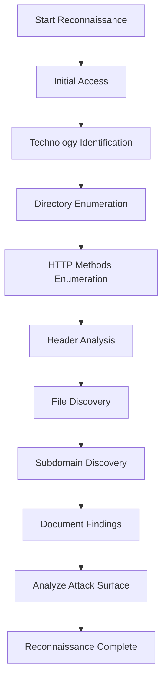

# Lab 1.6: Comprehensive Web Reconnaissance

## Learning Objectives
- Perform complete web reconnaissance workflow
- Combine multiple enumeration techniques
- Document findings systematically
- Identify all attack surfaces
- Capture the flag

## What is Comprehensive Web Reconnaissance?

Comprehensive web reconnaissance combines all enumeration techniques to build a complete picture of a web application:
- **Directory Enumeration**: Find hidden directories and files
- **Technology Identification**: Identify technologies and versions
- **HTTP Methods**: Enumerate allowed HTTP methods
- **Header Analysis**: Analyze security headers and information disclosure
- **Subdomain Discovery**: Find additional attack surfaces

This lab requires you to use ALL techniques from labs 1.1-1.5 to find the flag.

## Solution Walkthrough

### Step 1: Add Hostname to /etc/hosts

Add the target hostname to your `/etc/hosts` file:

```bash
# Add this line (replace <target_ip> with the IP shown in the lab panel)
<target_ip>    target.lab
```

### Step 2: Initial Access and Technology Identification

Start with basic access and technology identification:

```bash
# Access the main page
curl http://target.lab

# Get headers for technology identification
curl -I http://target.lab
```

**Findings:**
- Server: Apache/2.4.54
- X-Powered-By: PHP/8.1.0
- X-Framework: Laravel/10.0.0
- X-Application-Version: 2.1.3

### Step 3: Directory Enumeration

Use gobuster to discover hidden directories:

```bash
# Directory enumeration
gobuster dir -u http://target.lab -w /usr/share/wordlists/dirb/common.txt -t 50
```

**Expected findings:**
- `/admin/` - Admin area
- `/api/` - API endpoint
- `/backup/` - Backup files
- `/config/` - Configuration files
- `/private/` - Private directory
- `/uploads/` - Upload directory

### Step 4: Check robots.txt

Check robots.txt for additional information:

```bash
curl http://target.lab/robots.txt
```

**Output:**
```
User-agent: *
Disallow: /admin/
Disallow: /api/
Disallow: /backup/
Disallow: /config/
Disallow: /private/
Disallow: /uploads/
```

This confirms the directories found and reveals `/private/` directory.

### Step 5: Technology Identification - Check Version Files

Look for version files:

```bash
# Check for version file
curl http://target.lab/version.txt

# Check for readme
curl http://target.lab/readme.html
```

**Findings:**
- Application Version: 2.1.3
- Framework: Laravel 10.0.0
- PHP Version: 8.1.0

### Step 6: HTTP Methods Enumeration

Test HTTP methods on the API endpoint:

```bash
# Test OPTIONS method
curl -X OPTIONS http://target.lab/api/ -v

# Test other methods
curl -X PUT http://target.lab/api/
curl -X DELETE http://target.lab/api/
```

**Findings:**
- OPTIONS reveals: GET, POST, PUT, DELETE, OPTIONS are allowed

### Step 7: Header Analysis

Analyze headers for information disclosure, especially custom headers that may reveal sensitive information.

**Detailed Steps:**

1. **Check headers endpoint:**
   ```bash
   curl -I http://target.lab/headers.php
   ```

2. **Get all headers with verbose output:**
   ```bash
   curl -v http://target.lab/headers.php 2>&1 | grep -i "header"
   ```

3. **Get full headers:**
   ```bash
   curl -I http://target.lab/headers.php
   ```

   **Expected output:**
   ```
   HTTP/1.1 200 OK
   Server: Apache/2.4.54
   X-Security-Headers: Missing
   X-Debug-Mode: enabled
   X-Internal-Path: /var/www/html/private/flag.txt
   X-Flag-Hint: Check private directory
   Content-Type: text/html
   ```

4. **Extract custom headers:**
   ```bash
   curl -I http://target.lab/headers.php | grep -i "X-"
   ```

**Key headers found:**
```
X-Security-Headers: Missing
X-Debug-Mode: enabled
X-Internal-Path: /var/www/html/private/flag.txt
X-Flag-Hint: Check private directory
```

**What these headers reveal:**
- `X-Security-Headers: Missing` - Security misconfiguration
- `X-Debug-Mode: enabled` - Debug mode is on (information disclosure risk)
- `X-Internal-Path: /var/www/html/private/flag.txt` - **CRITICAL: Reveals flag location!**
- `X-Flag-Hint: Check private directory` - Hint about flag location

**Critical finding**: `X-Internal-Path` reveals the flag location at `/var/www/html/private/flag.txt`, which corresponds to the web path `/private/flag.txt`!

### Step 8: Access Private Directory

Based on header analysis, check the private directory where the flag is located.

**Detailed Steps:**

1. **Check private directory listing:**
   ```bash
   curl http://target.lab/private/
   ```

   **Expected output:**
   ```
   <html>
   <head><title>Private Directory</title></head>
   <body>
   <h1>Private Area</h1>
   <ul>
   <li><a href="flag.txt">flag.txt</a></li>
   </ul>
   </body>
   </html>
   ```

2. **Get flag file directly:**
   ```bash
   curl http://target.lab/private/flag.txt
   ```

   **Expected output:**
   ```
   OCR{c0mpr3h3ns1v3_r3c0n_b4s1c}
   ```

3. **Alternative: If directory listing is disabled, try direct access:**
   ```bash
   curl http://target.lab/private/flag.txt
   ```

4. **Verify flag format:**
   - Flag should start with `OCR{` and end with `}`
   - Contains alphanumeric characters and underscores

**Flag:**
```
OCR{c0mpr3h3ns1v3_r3c0n_b4s1c}
```

**Troubleshooting:**
- If you get 403 Forbidden, the directory exists but access is restricted
- If you get 404, verify the path from headers: `/private/flag.txt`
- Try different paths: `/private/FLAG.txt`, `/private/flag`, `/private/.flag.txt`

### Step 9: Verify Flag Format and Complete Reconnaissance

Ensure the flag is correct and verify you've completed all reconnaissance steps.

**Flag format:**
```
OCR{c0mpr3h3ns1v3_r3c0n_b4s1c}
```

**Verification checklist:**
- ✅ Starts with `OCR{`
- ✅ Ends with `}`
- ✅ Contains only alphanumeric characters and underscores
- ✅ No extra spaces or characters

**Success Criteria:**
- ✅ Successfully added hostname to /etc/hosts
- ✅ Performed initial access and technology identification
- ✅ Identified technologies: Apache, PHP, Laravel
- ✅ Performed directory enumeration with gobuster
- ✅ Discovered multiple directories: /admin, /api, /backup, /config, /private, /uploads
- ✅ Checked robots.txt and confirmed directories
- ✅ Checked version files for application details
- ✅ Enumerated HTTP methods on API endpoint
- ✅ Analyzed headers and found X-Internal-Path header revealing flag location
- ✅ Successfully accessed /private directory
- ✅ Retrieved flag from /private/flag.txt
- ✅ Verified flag format is correct: `OCR{...}`

**Key Learning Points:**
- Comprehensive reconnaissance combines multiple techniques
- Information from one technique (headers) can guide another (directory access)
- Custom headers often contain sensitive information
- Always check multiple sources (headers, files, directories, methods)

## Complete Reconnaissance Checklist

Use this checklist to ensure comprehensive enumeration:

### 1. Initial Access
- [ ] Add hostname to /etc/hosts
- [ ] Access main page
- [ ] Check HTTP status codes

### 2. Technology Identification
- [ ] Analyze HTTP headers (Server, X-Powered-By, X-Framework)
- [ ] Check HTML source for meta tags
- [ ] Look for version files (version.txt, readme.html)
- [ ] Check robots.txt
- [ ] Use Wappalyzer or similar tools

### 3. Directory Enumeration
- [ ] Run gobuster/dirb/ffuf
- [ ] Check discovered directories
- [ ] Look for common files (.htaccess, .env, config files)
- [ ] Check for backup files (.bak, .old, .backup)

### 4. HTTP Methods
- [ ] Test OPTIONS method
- [ ] Test PUT method
- [ ] Test DELETE method
- [ ] Test TRACE method
- [ ] Check Allow header

### 5. Header Analysis
- [ ] Retrieve all headers
- [ ] Check for security headers (missing or weak)
- [ ] Look for information disclosure headers
- [ ] Check custom headers
- [ ] Analyze multiple endpoints

### 6. File Discovery
- [ ] Check for common files
- [ ] Look for configuration files
- [ ] Check for backup files
- [ ] Look for hidden files

### 7. Documentation
- [ ] Document all findings
- [ ] Note discovered technologies
- [ ] List all directories found
- [ ] Record security issues
- [ ] Map attack surface

## Comprehensive Reconnaissance Workflow



## Tools and Commands Summary

### Technology Identification
```bash
curl -I http://target.lab
curl http://target.lab/version.txt
curl http://target.lab/robots.txt
whatweb http://target.lab
```

### Directory Enumeration
```bash
gobuster dir -u http://target.lab -w /usr/share/wordlists/dirb/common.txt
dirb http://target.lab
ffuf -w /usr/share/wordlists/dirb/common.txt -u http://target.lab/FUZZ
```

### HTTP Methods
```bash
curl -X OPTIONS http://target.lab -v
curl -X PUT http://target.lab
curl -X DELETE http://target.lab
nmap --script http-methods http://target.lab
```

### Header Analysis
```bash
curl -I http://target.lab
curl -v http://target.lab
curl -I http://target.lab/headers.php
```

### File Discovery
```bash
curl http://target.lab/.htaccess
curl http://target.lab/config/database.txt
curl http://target.lab/backup/
```

## Hints

1. Start with technology identification to understand the stack
2. Use directory enumeration to find hidden directories
3. Check robots.txt for directory hints
4. Test HTTP methods on different endpoints
5. Analyze headers from multiple endpoints
6. Look for custom headers that reveal information
7. Check all discovered directories for files
8. Flag is in a directory revealed by header analysis

## Common Mistakes

- Not following a systematic approach
- Skipping steps from previous labs
- Not checking multiple endpoints
- Missing header analysis
- Not documenting findings
- Giving up before checking all directories
- Not combining information from different techniques
- Missing the connection between headers and directory structure

## Educational Context

### Why Comprehensive Reconnaissance Matters

- **Complete Picture**: Combines all techniques for full understanding
- **Attack Surface**: Identifies all potential vulnerabilities
- **Systematic Approach**: Ensures nothing is missed
- **Real-World**: Mirrors actual penetration testing workflow

### Reconnaissance Best Practices

1. **Systematic**: Follow a structured approach
2. **Thorough**: Don't skip steps
3. **Document**: Record all findings
4. **Combine**: Use information from multiple sources
5. **Verify**: Confirm findings with multiple tools
6. **Organize**: Structure findings logically

### Real-World Application

- **Penetration Testing**: First phase of any assessment
- **Bug Bounty**: Essential for finding vulnerabilities
- **Security Audits**: Required for compliance
- **Red Team Exercises**: Foundation for all attacks

## Further Reading

- OWASP: Information Gathering
- Penetration Testing Execution Standard (PTES)
- Web Application Hacker's Handbook
- Bug Bounty Methodology

